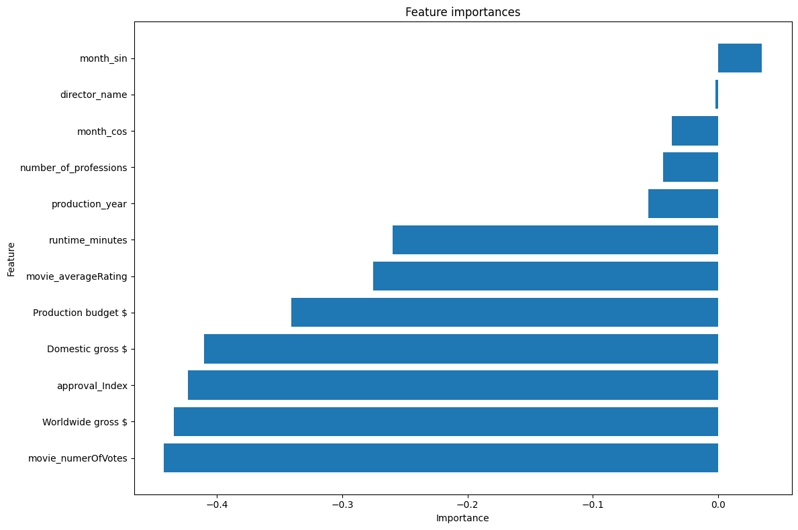

dzień dobry, miejsce do popisu dla was, z góry dzięki za feedback

dzień dobry,

- ciekawa nawet korelacja miedzy runtime a avgRating - mozna by sie temu przyjrzec jeszcze
- czy mysleliscie ze moze miesiac produkcji filmu nie moglby sie okazac przydatny? np. moze filmy wypuszczone w danym okresie maja wiecej ratingow or sth, taka luzna mysl ze moznaby sprawdzic 
- ciekawy peak liczbie filmow wyprodukowanych jakos ok. 2006/2008 moznaby spr dla tego okresu dokladniej ile dany rok 
- moznaby spr czy directors ktorzy maja wiecej professions moze produkuja lepiej oceniane filmy albo na odwrot chociaz nwm czy to ciekawy pomysl
- moznaby sprawdzic jakie gatunki ciesza sie najwieksza popularnoscia/sa najlepiej oceniane
- nie wszystkie filmy majace ten sam tytul i date produkcji sa duplikatami (nie sprawdzalam wszystkich takihc filmow wiec byc moze ktores to duplikaty) - np. przykladowe filmy Weekend to osobne produkcje - production_date moze nie byc miarodajne (ale rok sie zgadza dla wszystkich tych filmow wedlug imdb/filmwebu przynajmiej), nie wiem z jakiego zrodla byly brane te daty i ta ramka ale no dokladne daty sie niekoniecznie pokrywaja z internetem chyba ze zle sprawdzam, ale bardzo fajnie ze sie temu przyjrzeliscie ogolem 
- moznaby sprawdzic ile directors ile filmow w ramce chyba ze bylo spradzone i mi umknelo gdzies wyzej w analizie
- dobra propozycja encodingu gatunkow 

niektore pomysly wsm moga byc bezsensowne, ale pisalam wszystko co przyszlo mi do glowy, Karolina :)

KM2
do KM2_Z na razie
- fajnie ze zrobiliscie cykliczne kodowanie miesiecy
- imiona moim zdaniem niepotrzebne - mozna usunąć, ale tez wsm nie wiem czy jak wszystkie wartości rózne to jakoś źle na model wpływa 
- nie wiem ile dokladnie jest duplikatow u was (u nas 3) ale recznie pewnie czasochlonnie poprawianie imo mozna losowac jakos ewentualnie uwzgledniajac rok urodzenia rezysera zanim wywalicie albo po prostu totalnie losowo z przedzialow jakie przyjmuja konkretne kolumny w ramce
- fajny pomysl zeby zrobic ze czesc serii to jest, ale ciezko moze byc do wykonania, niektore serie nie maja takich samych rzeczy w tytulach plus ale moznaby sprobowac dla tych co maja, tylko musielibyscie jakos powypisywac wszystkie tytuly z powtarzajacymi sie nazwami i poszukac ktore z nich to serie itd. wydaje sie to bardzo czasochlonne wiec nie wiem czy warto, mozecie spytac pania Tomaszewska czy jest jakis sprytny sposob jak to zrobic bo pomysl fajny
- nie wiem jak sie standaryzacja ma do konkretnych metod; standaryzacja wam moze chyba pomoc przy roznych jednostkach i skalach jak macie np average od 0 do 10 a przychod rzedu kilkunasty tysiecy czy cos tego typu to moze warto ustandaryzowac, nie mam pojecia dlaczego dla lokciowego sie wyplaszcza ale pociesze was ze u nas tez, moze sie robi taka jedna wielka kupa punktow ze ciezko wyekstrachowac klaster nwmm
- u nas TSNE bardziej rogalika przypomina i wsm takie te klastry wyszly niby ok niby nie nwm ale wsm podobnie pogrupowane jak u was

do KM2_M (kontynuacja KM2_Z i guess)
- usuniecie movie titles nieglupie, bo wiekszosc z tych filmow o ile nie wszystkie jest unikatowych jesli dobrze rozumiem, mediana tez spk pomysl albo wlasnie losowanie z normalnego rozkladu czy cos zeby wam sie mniej wiecej losowalo tak jaki mieliscie rozklad tych zmiennych; fajnie ze probowaliscie zrobic model ktory przewiduje takie rzeczy, podziwiam
- moim skromnym zdaniem usuwanie outlieru w waszym przypadku chyba nie ma jakiegos wiekszego sensu, ale tak wsm to sie nie znam
- feautre importance - fajny pomysl zeby sprawdzic
 
u nas ciekawie wyszlo na walidacyjnym
- to tsne na v1 to isntne konfetti
